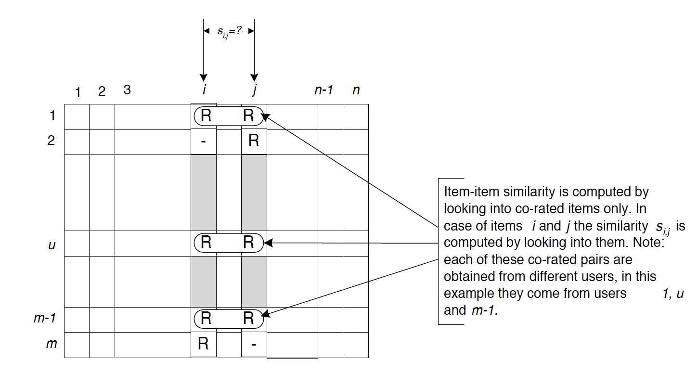

# Recommand System using Collaborate Filtering

## Introduction

The personalized recommendation system, based on a collaborative filtering algorithm (CF), has been successfully applied in the Internet field, especially in the aspects of e-commerce and advertising business. User-based CF, item-based CF, are traditional common collaborative filtering algorithm.

There are three different collaborative filtering algorithms in this repository: User-based CF, Item-based CF; and Matrix Factorization Latent Factor model. Their performance are evaluated and compared by RMSE.

## Dataset Description

In this project, the data set is from the Grouplens site with 100,836 ratings applied to 9,742 movies by 610 users. 

## Train-test Set Split

To evaluate the performance of the algorithm, we have to split the data into the train set and test set.

The method is based on users, which means that for each user, we split the movies he watched with a fixed portion, which is 0.8 in this experiment, one into the train set and the other into the test set. 

After the train-test split, the train set and test set both contain all users. We use the train set to predict every possible user-movie combination's rating and compare it with the test set.

## Evaluation Method

This project uses cross-validation to prevent over-fitting, which may be caused by overly complex models and evaluate by Root Mean Squared Error (RMSE) to measure the model accuracy.

1. K-fold cross validation

2. Root Mean Squared Error (RMSE)

## Collaborative Filtering

Collaborative Filtering algorithm is the most popular type of recommendation algorithm, which has successfully applied in a variety of areas, like Netflix, Youtube, e-bay and so on. 

The advantage of collaborative Filtering algorithm is that it does not require abundant domain-specific knowledge and uncomplicated engineering implementation. User-based collaborative filtering, item-based collaborative filtering, and model-based collaborative filtering are three types of collaborative filtering recommendations. Among them, User-based CF and item-based CF are on memory-based. Different Collaborative Filtering algorithm can be adapted to a variety of recommendation system requirements. Usually, model-based collaborative filtering is the most popular type of collaborative filtering recommendation system.

## User-based

### Theory

The key idea of User-based collaborative filtering is that we assume users can give valuable advice to another user who is very similar to them. So we can gather the “opinions” from other similar users to give recommendation suggestions to our target user.

Our goal has two parts, one is to evaluate a rating for some specific user-movie combination. For example, we have user $a$ and movie $m$ and we need to predict what rating will user $a$ gives to movie $m$. The other is to recommend some movies to users.

So how to do that? According to the user-based collaborative filtering theory, we first need to find all users who watched movie M, name them as a set U~m~. Then we need to find the top K (K is an integer used to decide how many similar users we needed to make a prediction) most similar users other than A himself in the list U~m~, name them as another set U~mKa~, sometimes the number of users in U~m~ might less than K, so in such condition, we will use all these users as voters.

So how to evaluate the similarity between two users? This is the core of the User-based collaborative filtering. It is natural to think that two users are very similar if they have a lot of common movies watching history. On the other hand, they should have similar tastes if they have close ratings on the same movie.

### Implementation

The training process may take up to 30 minutes to finish.

#### Calculate the similarity matrix

According to the similarity formula mentioned above, some components we need to get are N(u) for every user u and ​C(u, v)​ for every (u, v) combination.

It is easy to get N(u)​, we just need to group the data by user, and find the length of each group.

To get C(u,v)​, we just need to intesect N(u)​ and ​N(v)​.

Finally put them into the similarity formula and get the result.

#### Performance

We use cross validation to test this recommendation system's performance and here is the result:

Mean RMSE: 0.954, variance: 2.21e-5.

From the result, I think the User-based recommend system does a good job and has a very stable performance.

#### RMSE on different K values

We also tried different K values to see if there will be any difference.

Here is the result:

Same as our anticipation, with the growing of K value, the RMSE error drops rapidly at first, then decreases gently. 

## Item-based

In this part, we will try to use the Item-based Collaborative filtering algorithm to predict scores for a set of unwatched movies by a specific user and recommend some movie to this user. Unlike the User-based CF algorithm, the item-based method looks into the connections between the set of movies the target user has rated and the movies the target user has not interacted yet. This approach compute the similarity between a target movie $j$ and selected $k$ most similar movies $\{i_1,i_2,...,i_k\}$ the target user has rated. By having the corresponding similarities $\{s_{j,1},s_{j,2},...,s_{j,k}\}$ , the prediction is computed as a weight average score to the target movie $ j$.

### Theory

The key assumption behind this algorithm is that we assume users will always remain their taste in movies.

This whole modelling process can be divided into two steps, namely, Similarity Calculation and Prediction. The similarity computation is the most critical move in the entire modelling which determines if the final results are satisfying or not and is pre-computed beforehand.

#### Basic idea of similarity computation

To compute the similarity of two given movie $i$ and $j$ , by only looking into the co-rated users, a co-occurrence matrix $C$ is first constructed, and each entry in the matrix records the number of users who like both movie $i$ and movie $j$.

The figure1 represents the process of selecting co-rated users for movie $i$ and movie $j$. The columns are the movies and the rows are users.

Figure.3 elaborates how the co-occurrence matrix is constructed. Each row in the leftmost part indicates movies of a user, each entry in the matrix in the rightmost part implies the total number of users who interacted with both movie $i$ and movie $j$ .

### Implementation

#### Performance

A cross-validation is also applied for the measurement of accuracy of this predictive model, and an average RMSE of  0.863 and a variance of 1.13e-4 are obtained. This indicates the model is very steadible.

#### RMSE on different K values

After the experiments on a single target user, the scope is changed towards the performance of average RMSE on all users in terms of a range of K values. 

The figure indicates a rapid decrease when the K values increase in the starting point, and when the K values get larger, the average RMSE tends to be steadible as anticipation.

### Insights & Improvements

While experimenting, some unignorable problems are encountered. 

First, popular movies seem to have a higher similarity with other movies, which leads to a higher prediction. Eventually, the model will tend to recommend the popular movie but not necessarily be interested in the user. Therefore, to tackle this problem, a normalization on the weights is applied when computing the prediction. This improves the average RMSE to 0.891 with a K value of 10.

Another problem is that this algorithm can not make predictions on those movies that nobody has ever rated. Then the unpopular but high-quality movies are unlikely to be recommended before anyone becomes the first person who eats crab.

## Matrix Factorization Latent Factor Model

### Theory

The matrix factorization has an assumption that a set of common attributes exists for all items, also each user has their rating for each of these attributes, independent of items. These attributes are hidden and are called latent factors. One strength of matrix factorization is that it allows incorporation of more information, if explicit information is not available, the recommender system can still infer some implicit information and make use of it. This method also has a good extension performance. 

The key idea of matrix factorization collaborative filtering is to transform the matrix to represent latent factors, the missing value in the original matrix will be calculated by the decomposed matrix.

where **K** is an intermediate variable representing k latent factors, matrix **X(m,K)** represents the relationship between **m** movies and **K** features, matrix **Y(n,K)** represents the relationship between **n** users and **K** features, here we use cross-validation for choosing the optimal **K**. 

figure.5 Approximating the ratings matrix with row and column factors

This is called a low-rank approximation in linear algebra, which compressing the sparse data in R into lower dimension spaces **m×K** and **K×n**. The multiplication of **X** and **Y** would output a matrix **R**,  which is an approximation of original matrix **R**.

### Performance

We trained a model using the gradient descent optimizer, with learning rate initialized to 0.001, and the regularization parameter $\lambda$  is set to  0.7 as a cross-validation result. The model is built with 11 factors, with gradient descent running for 100 iterations. With this setting we obtained the following:

Mean train RMSE: 0.763, Mean test RMSE: 0.961

### Insights & Improvements

The problem of Latent Factor Model is that it is hard to implement real-time recommendation since it will incorporate all users' records to calculate the factorized matrices to represent the relationships between latent factors and users/items, also this model requires repeated iterations to achieve better performance, which is of high time complexity. 

This model can be improved by incorporating both user and item biases, also it can be improved by choosing better parameters of regularization, parameters too low could cause overfitting, and too high will lead to large prediction error.

